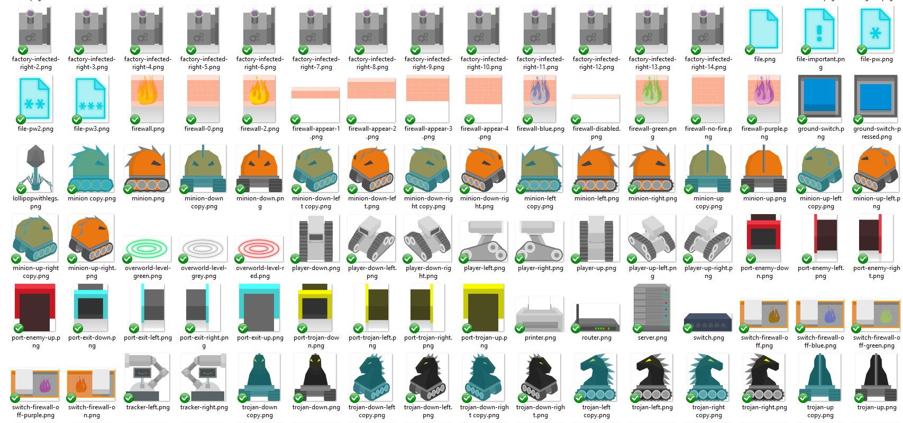
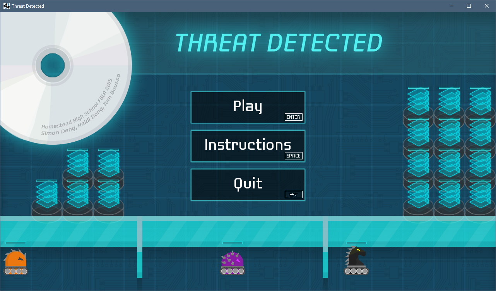
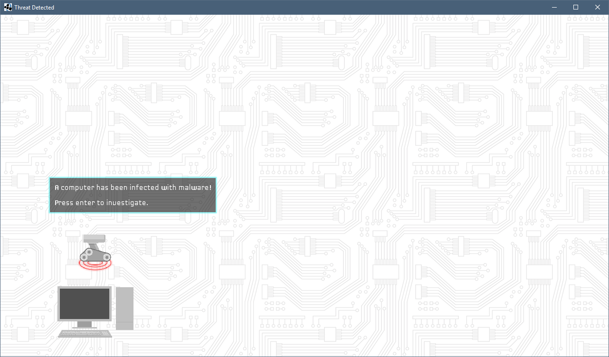
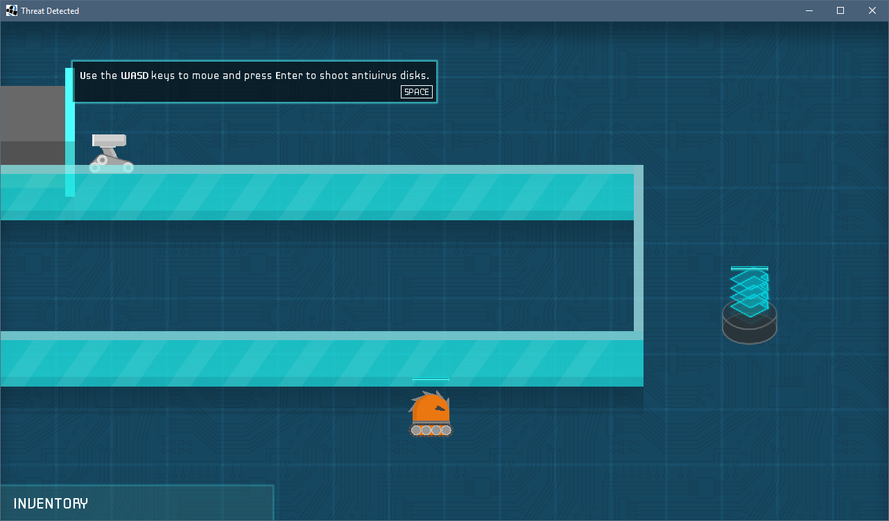
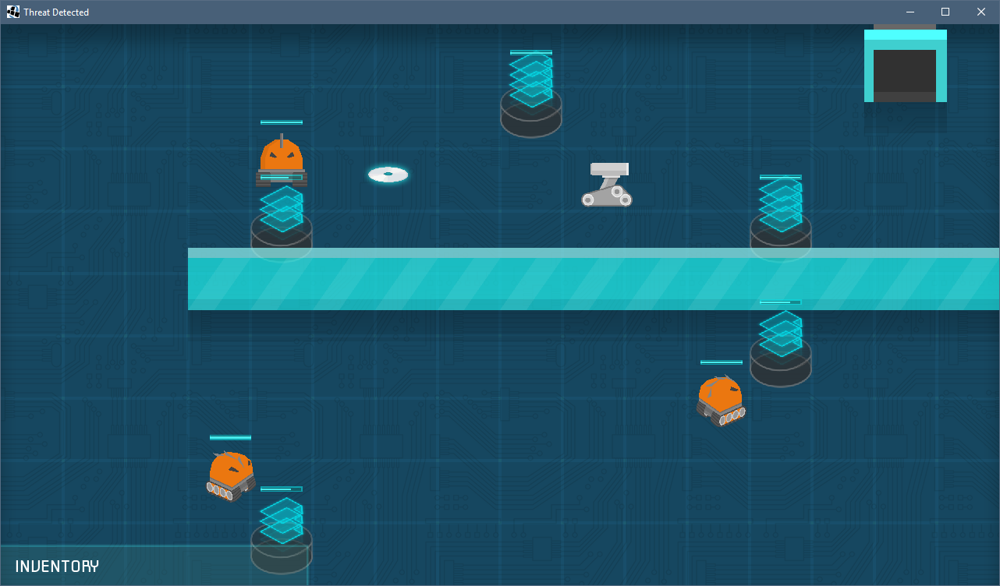
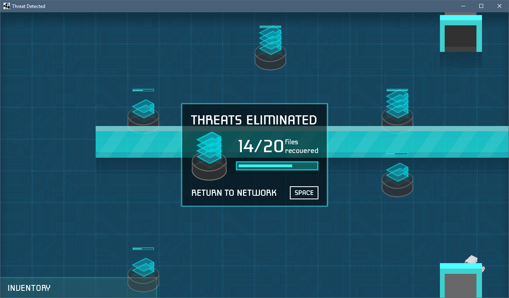
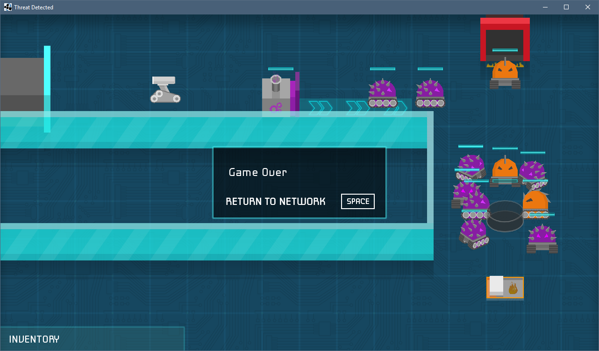

# Threat Detected

**Time period:** Jan 2015 – March 2015

**Team members:** Simon Deng, Tom Bousso

**Keywords:** Java, Photoshop, game design, visual design

**URL:** https://github.com/heidid/CGS/

Following this prompt, we created a Java game called Threat Detected that teaches cybersecurity concepts:
> You are a computer virus tracker. You live inside a computer and travel the network looking for viruses and malware. When some are detected, you have to travel to the infection site and launch anti-virus software discs at the malware minions. Escalate the adventure from basic network bugs to a Web Bot boss. Take note in design to include computer networking structure and devices.

I created **[over 1000 image assets](https://github.com/heidid/CGS/tree/master/core/assets/images)** for the game! Okay well, I generated the majority of them, which were animation frames, thanks to Photoshop Actions, batch automation, and occasionally a short Python script. Here's a sample:

## Gameplay screenshots
Start screen:

This is the inital overworld map, which is a computer network that is revealed as more levels are completed.

The first level is a tutorial that onboards the player to the game.

The objective is to shoot antivirus disks at the orange malware minions who are destroying stacks of files. 

Once all minions are destroyed, a port appears for the player to exit.

If all files are destroyed, then the level ends. In the level below, there's also a factory producing viruses and a firewall that must be put up by activating a switch.

