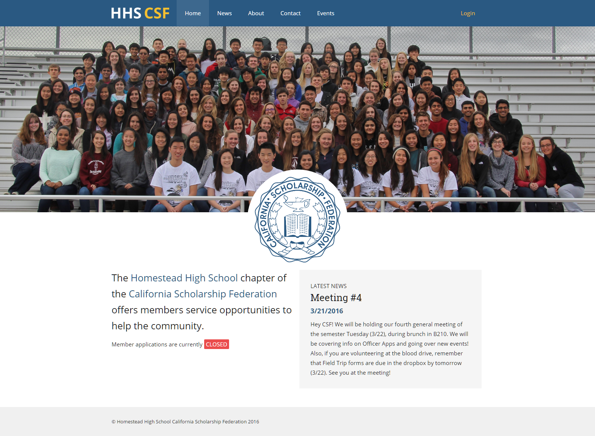
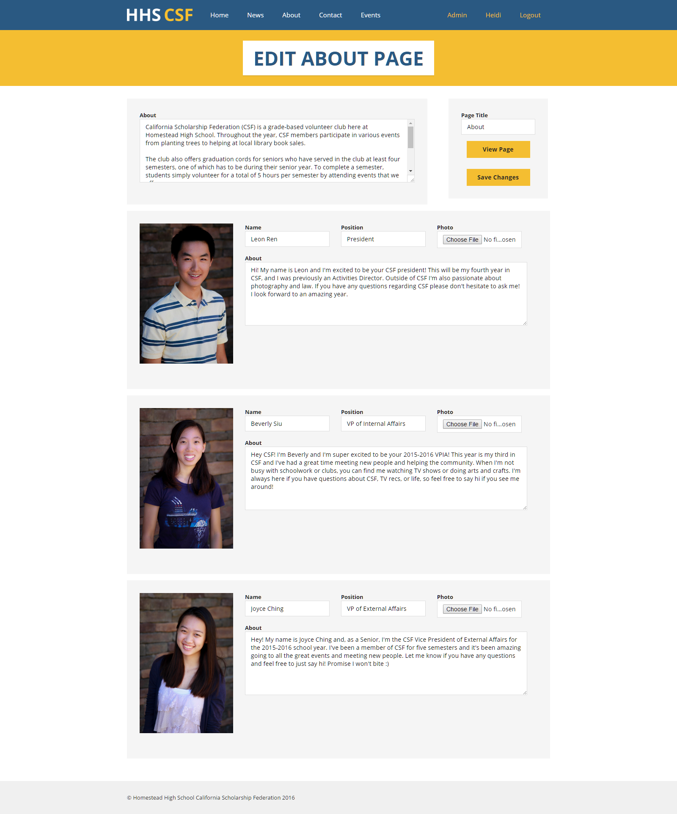
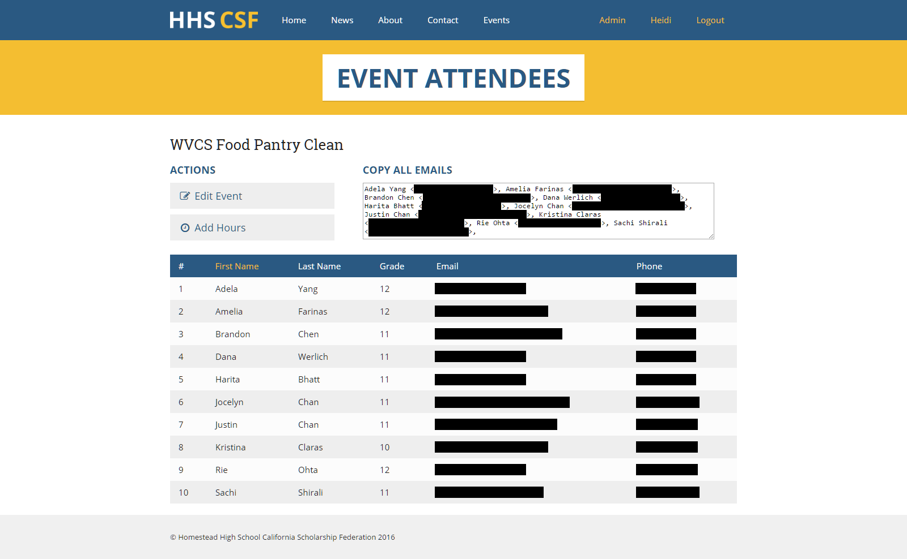
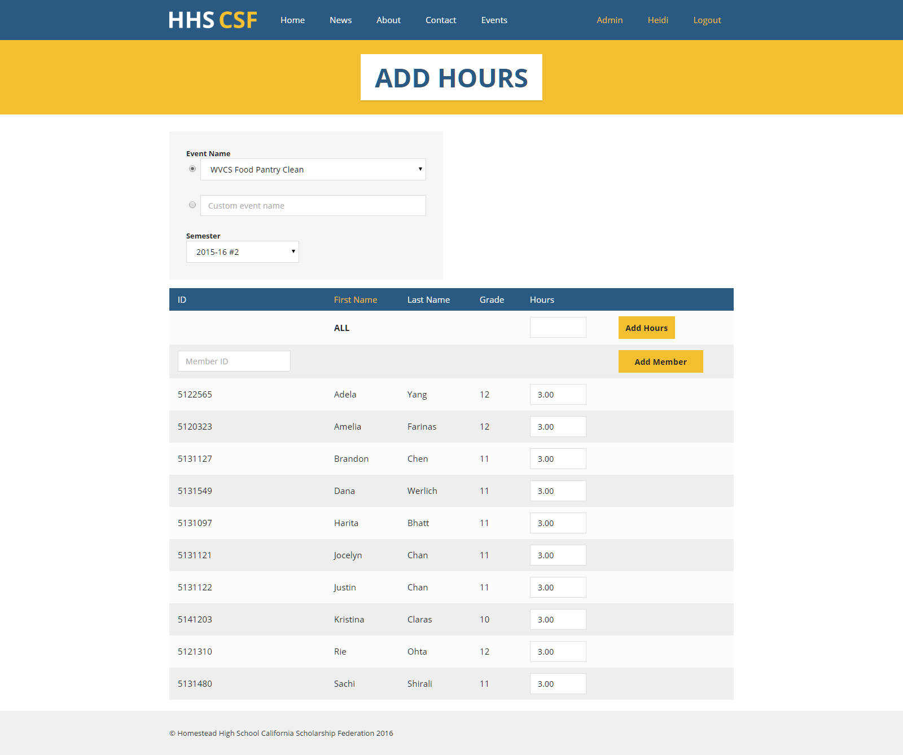
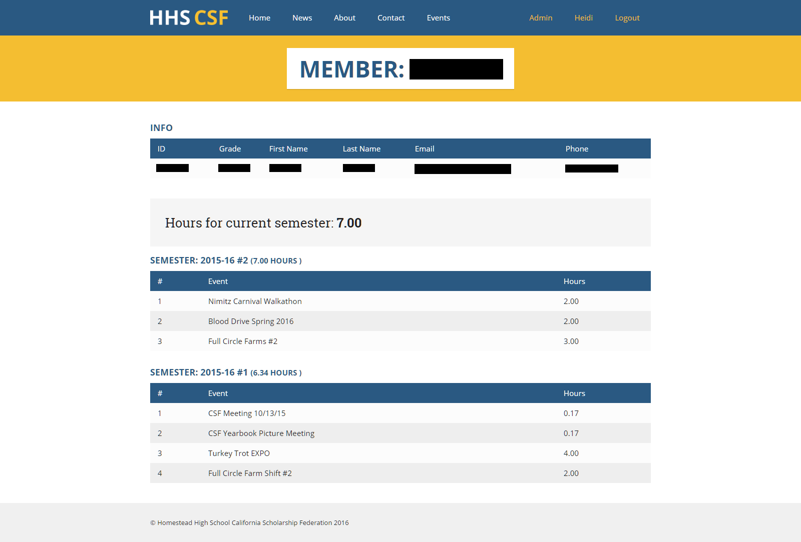
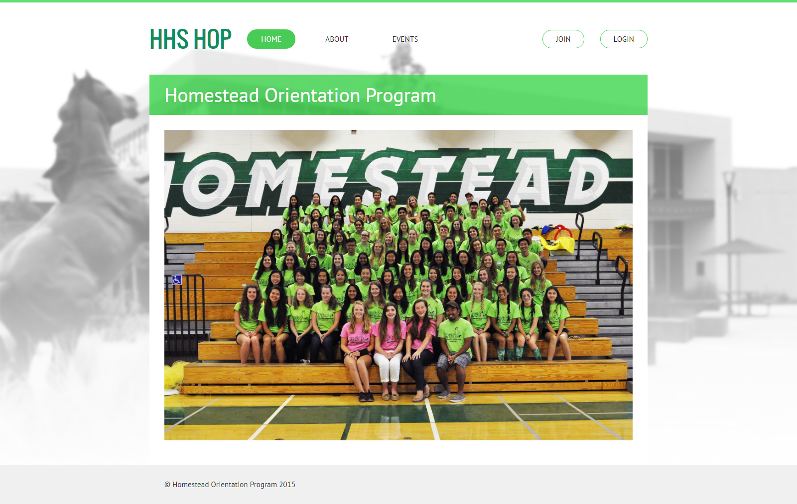
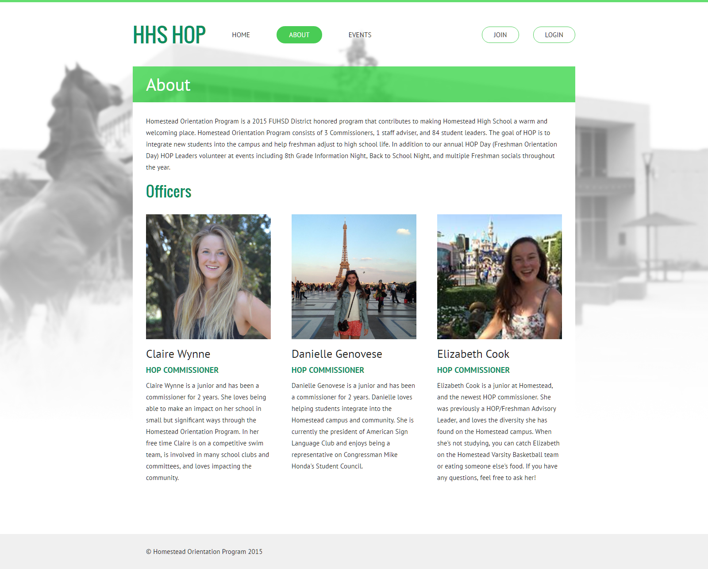
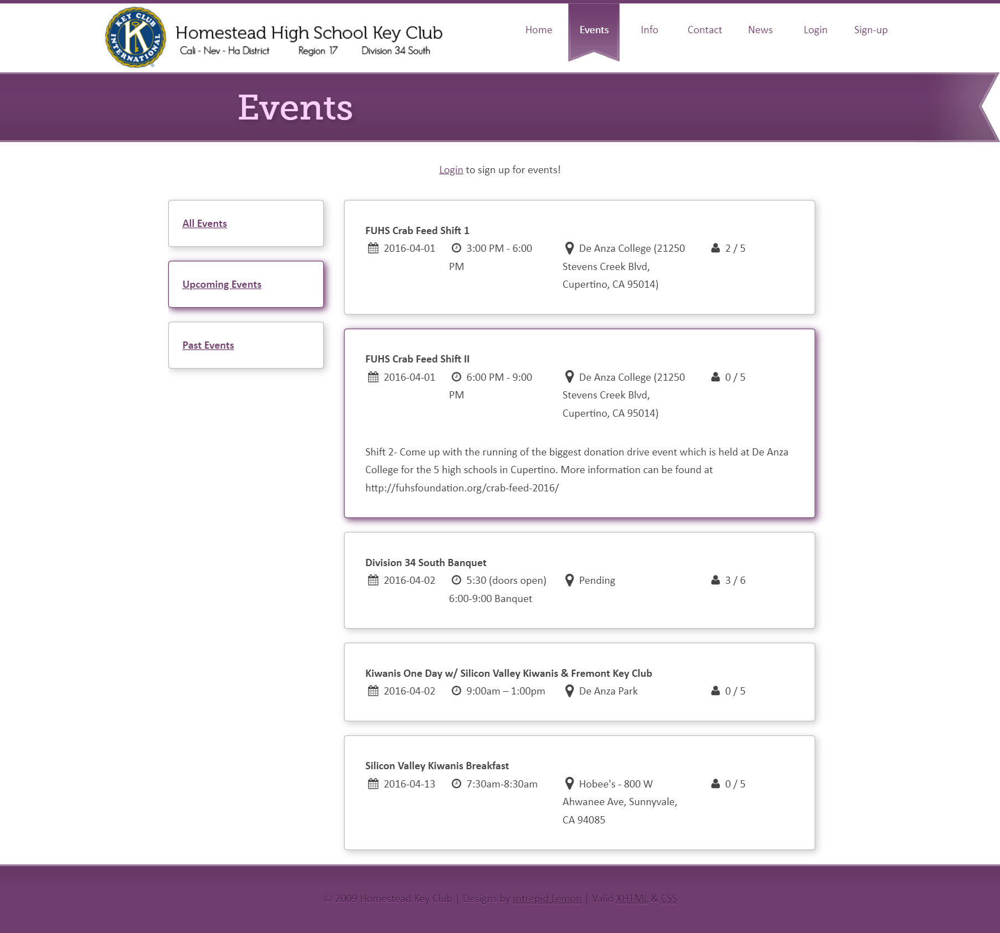
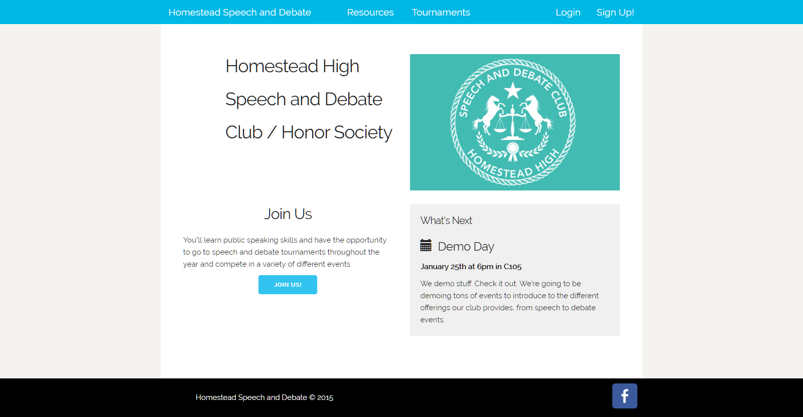
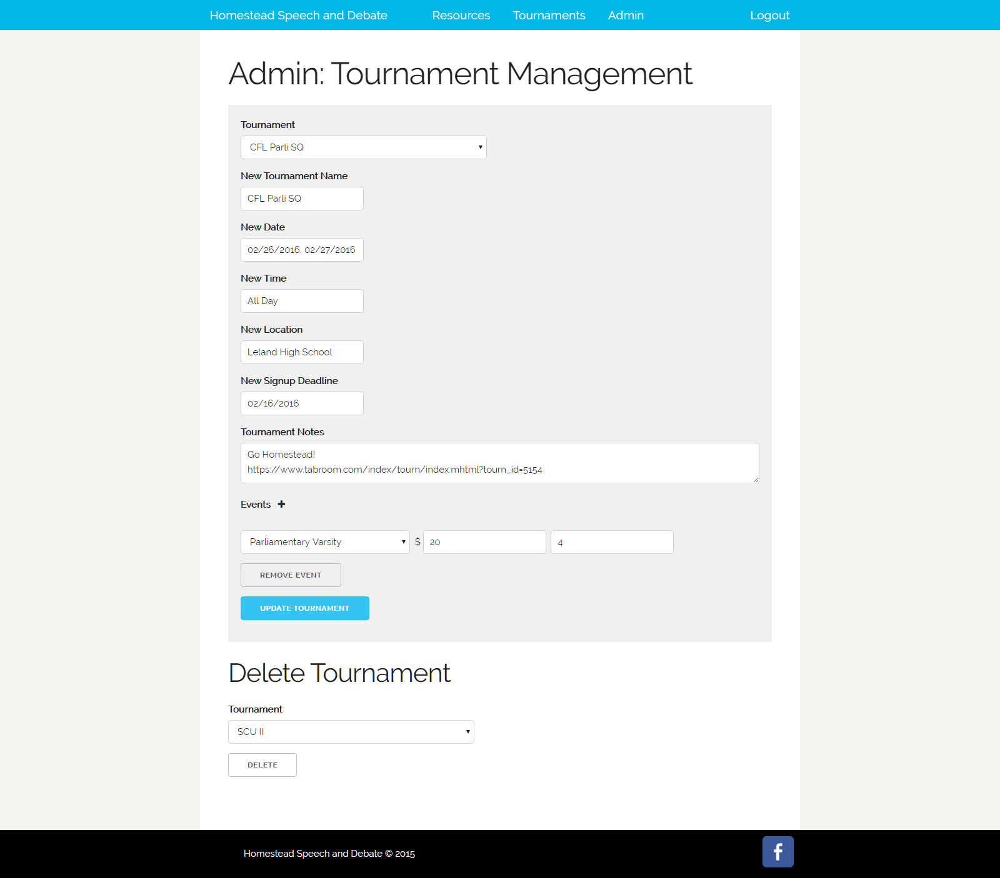

# Club Websites

**Time period:** June 2013 – August 2013

**Keywords:** HTML, CSS, JavaScript, PHP, MySQL, visual design

I designed and developed websites for several clubs at Homestead High School. These were collectively used by over 1200 students over 4 years, and some are still being used today.

Specifically, I created an event signup system for community service organizations to manage events, members, and volunteer hours. Previously, these were tracked in a mess of various spreadsheets and emails. I implemented my system with user-friendly admin panels and later as a Wordpress plugin.

## California Scholarship Federation (CSF)
Home page:

I made the site easy to edit:

Club officers can view a list of everyone who is signed up for an event, along with their contact info and a quick way of copying all of their email addresses (I redacted personal info from this screenshot):

Then, by clicking Add Hours, club officers can input hours for everyone who attended an event:

Members can track their own service hours (I redacted personal info from this screenshot):

## Homestead Orientation Program (HOP)
This site had the same features as described above, but with a different theme.

## Key Club
Key Club already had an existing website designed by someone else, and I extended the functionality by adding my event signup system.

As a viewer who is not logged in, the events list interface looked like this:

## Speech and Debate
I only worked on the backend portion of this site, modifying the database and admin interface to fit the needs of Homestead Speech and Debate.

