# Launch

**Time period:** Dec 2016 – Apr 2017

**Team members:** Varun Tandon, Michael Chen

**Keywords:** Android, Firebase, PayPal Braintree

**URL:** https://github.com/heidid/MAD

We created an Android app, Launch, for the [FBLA](https://www.fbla-pbl.org/fbla/competitive-events/) Mobile Application Development competition. After presenting to judges, our team won 2nd place at the California state level and 6th place nationally. 

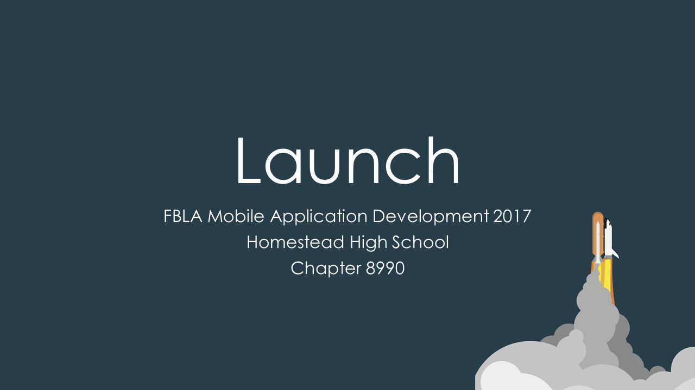

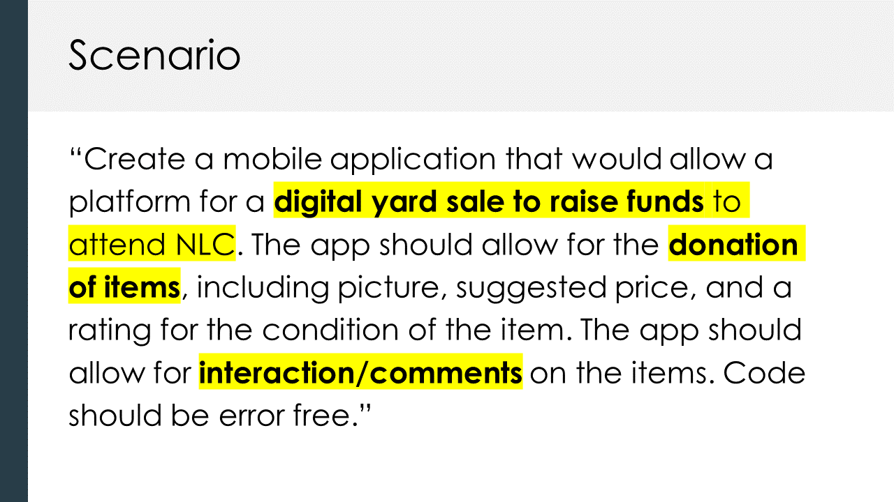

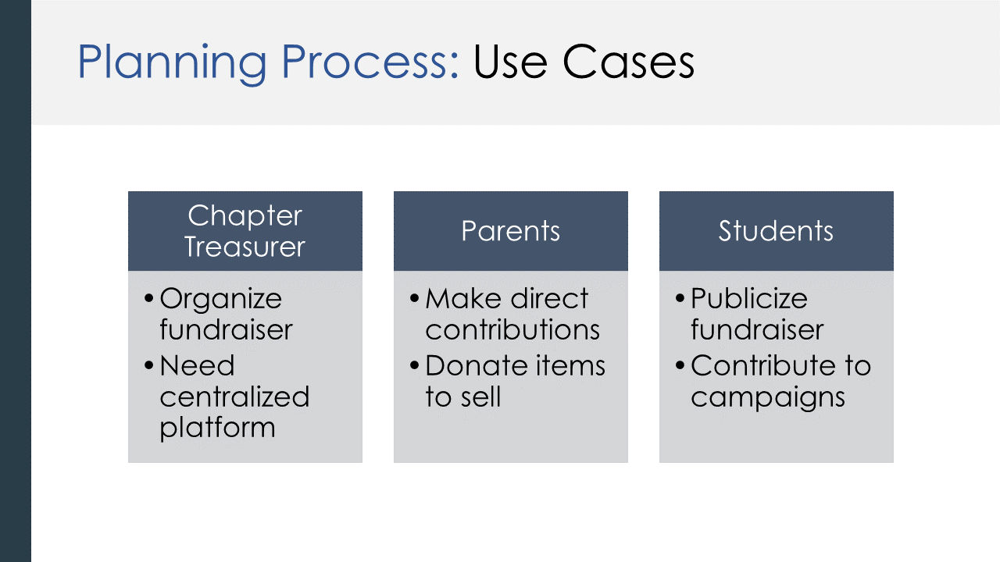

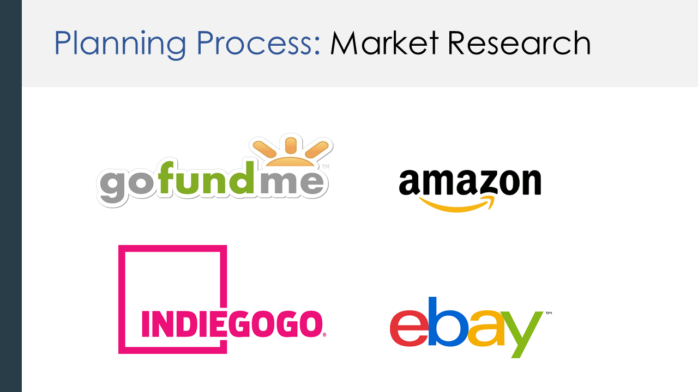

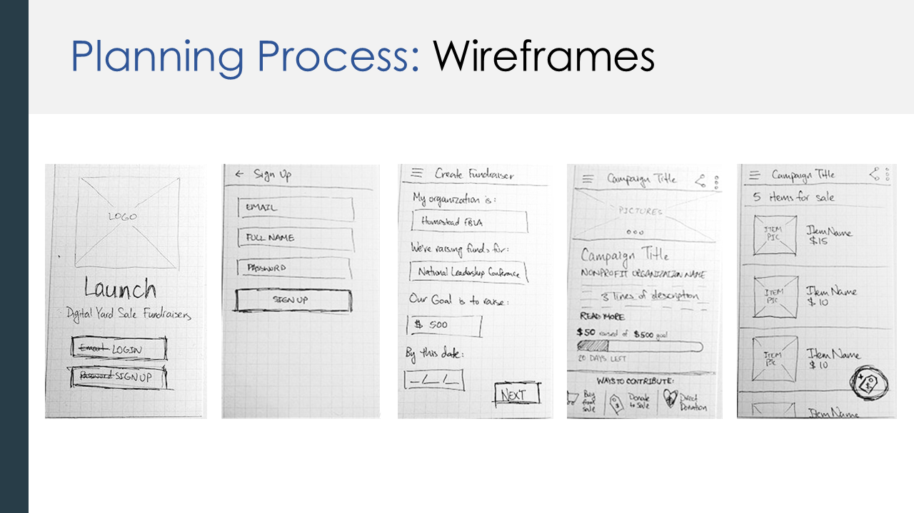

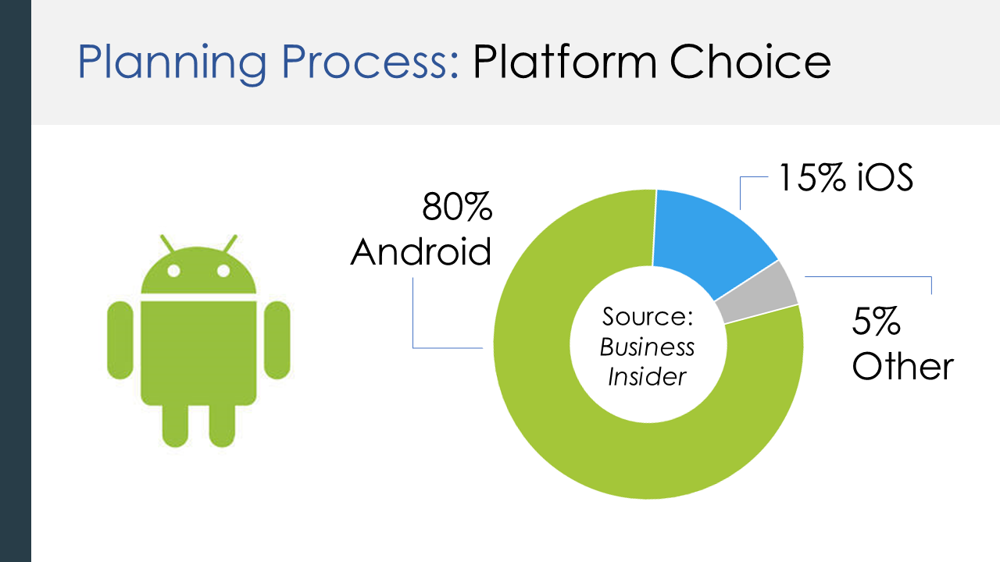

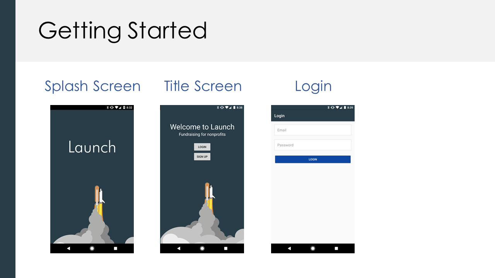

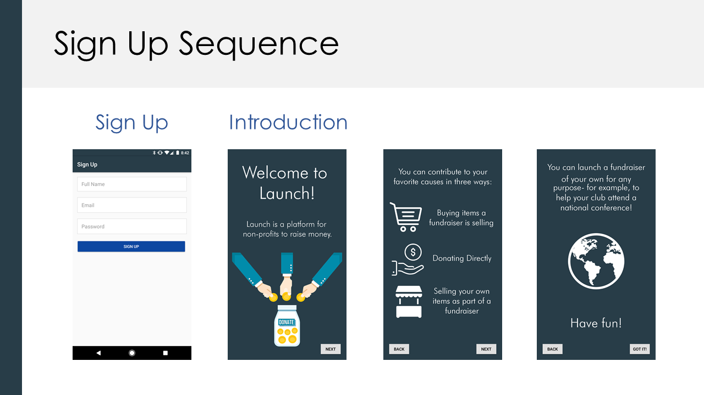

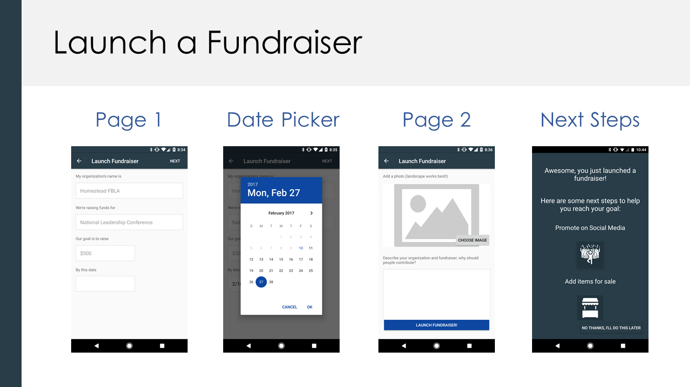

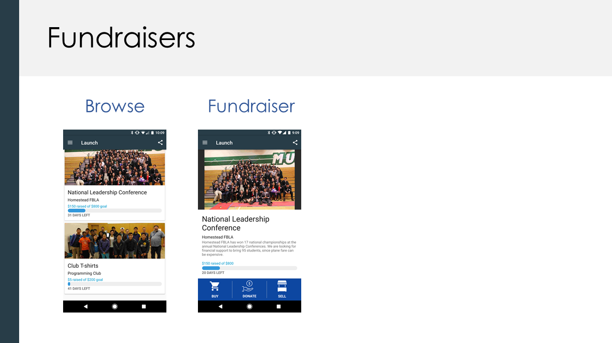

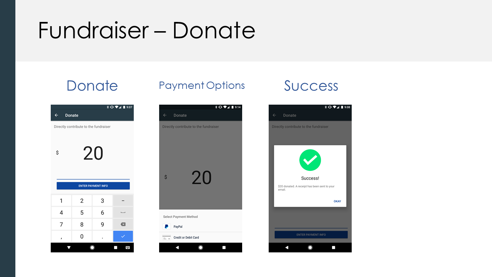

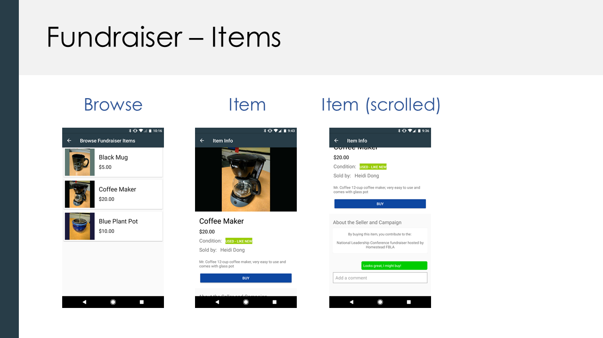

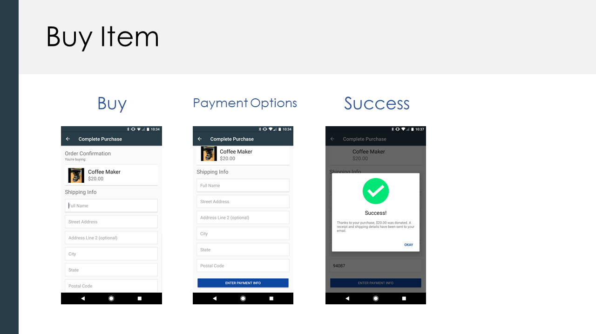

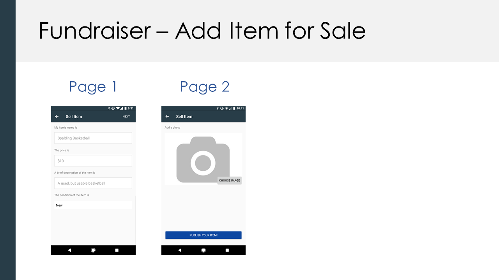

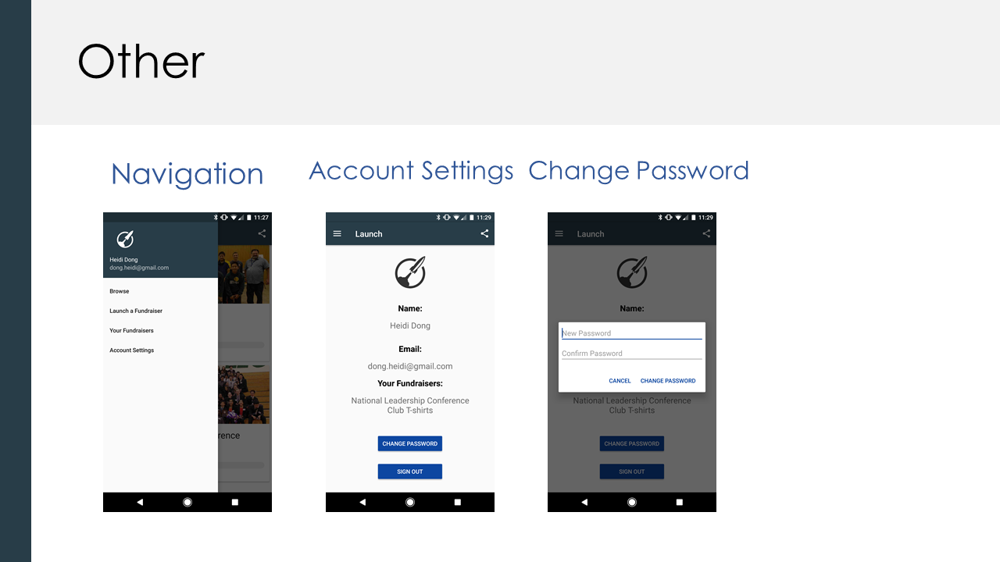

