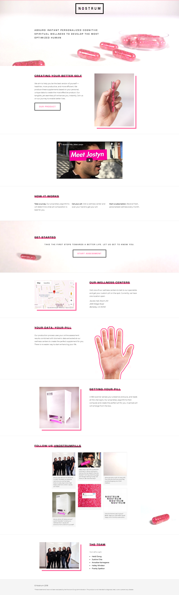
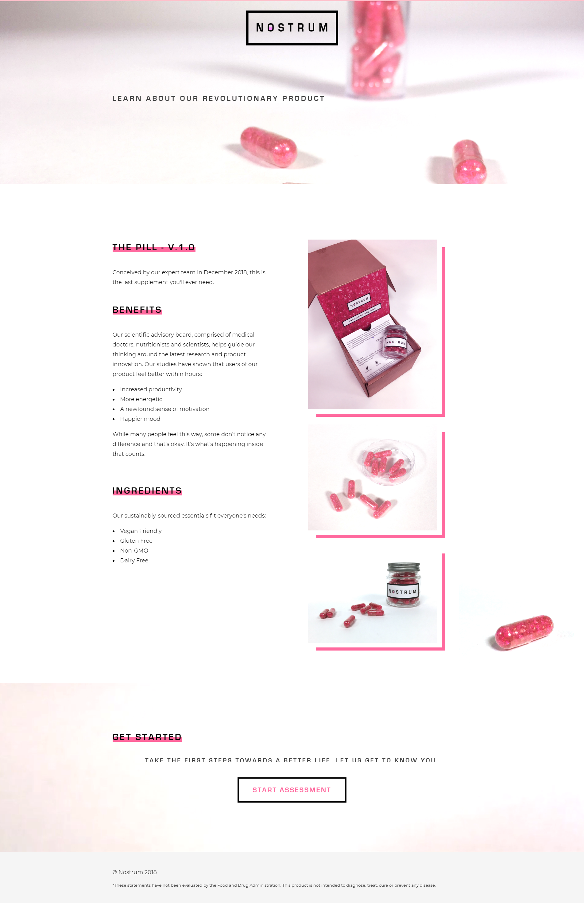

# Nostrum

**Time period:** Nov 2018 – Dec 2018

**Team members:** Justine Chia, Annalise Kamegawa, Franky Spektor, Hailey Windsor

**Context:** Final provocation project for New Media 190-3: Critical Practices: People, Places, Participation

**Keywords:** HTML, CSS, Arduino, product design, critique

**URL:** https://heidid.github.io/nostrum/

Nostrum is a fake company we created to critique the pseudoscientific wellness industry and the American desire for instantaneous solutions. Nostrum produces a personalized dietary supplement meant to instantly enhance your person through its unique optimization of the placebo.

Read the [full project write-up](nostrum.pdf).

Our work was featured also on the CITRIS Invention Lab website: _[All-woman team constructs clever commentary in CITRIS Invention Lab](https://citris-uc.org/all-woman-team-constructs-clever-commentary-in-citris-invention-lab/)_

Specifically, I designed the website component of this project.

Home page:

Product description page:

